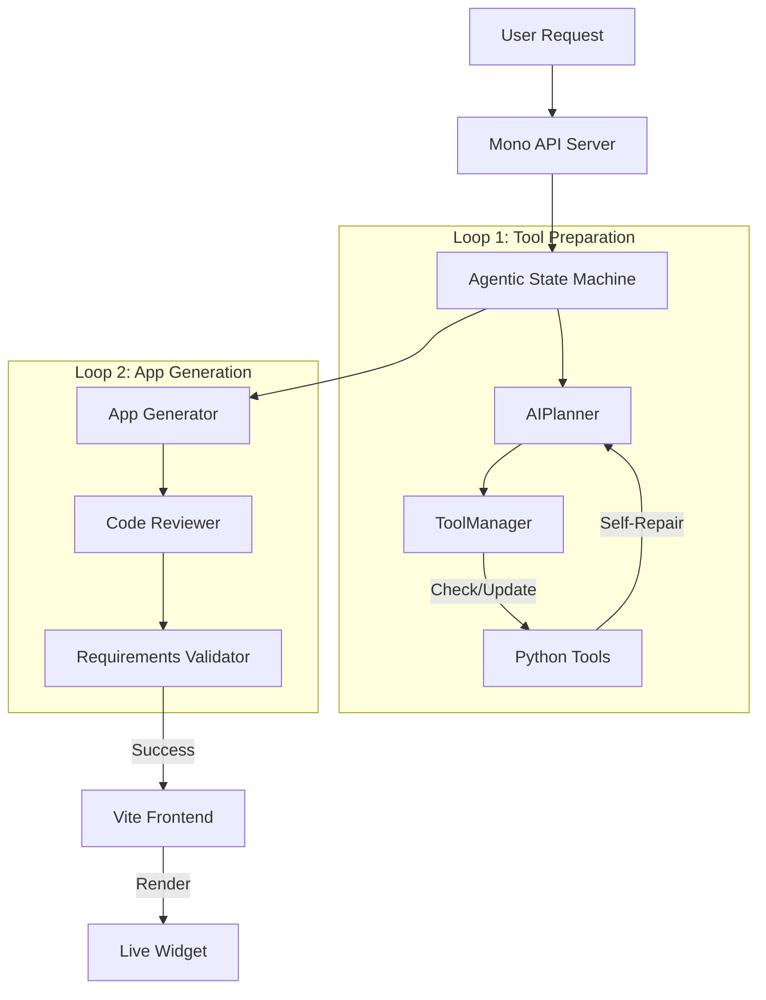

I recently spoke at [AI Tinkerers Raleigh](https://raleigh.aitinkerers.org/talks/rsvp_rjOw3LBlaI4) about hyperfast inference systems and how they're fundamentally changing AI application design. If you haven't heard of Cerebras (or however they pronounce it), you're in for a treat—this is one of the most exciting areas of research in AI right now.

## The Speed Revolution

The folks at Cerebras have done something remarkable: they've built a complete custom hardware stack using a full silicon wafer to create an incredibly fast inference chip. While your typical ChatGPT system delivers less than 100 tokens per second—and often drops to 20-30 tokens per second under load—Cerebras blasts through at **1,700 tokens per second**. That's almost 20x faster than standard transformer-based inference providers.

But Cerebras isn't alone in this race. **Groq** has their own custom hardware platform delivering 400+ tokens per second with their specialized models. Then there's **Mercury's diffusion models**—a completely different algorithm that doesn't require special hardware. These models run on standard CPUs and GPUs, and they're showing incredible promise for bringing hyperfast inference to edge devices like your laptop or phone. The best part? A new Llama-based diffusion model released just days after my talk potentially solved the Turing-complete problem that had been holding the technology back.

## When Pixels Become Instant: The Death of Static Software

Remember when Jensen Huang of Nvidia said "one day every pixel will be created by artificial intelligence"? Right after Stable Diffusion launched, that seemed confusing. But once you understand how AI can create applications at the click of a button, it clicks. The folks at Anthropic recently announced something bold: **software is solved**. People won't look at computers as things that run software anymore—they'll be tools that you use to get stuff done.

That's exactly what this prototype demonstrates.

## Cerebras OS v3 - Agentic Desktop Environment

This isn't just a demo; it's a next-generation AI-powered desktop environment where applications are generated, run, and repaired in real-time by a sovereign agentic system. And it's all powered by Cerebras' ultra-fast inference.

### Overview

<p><iframe style="width:100%;" height="515" src="https://www.youtube.com/embed/dthf15gqcQM" frameborder="0" allowfullscreen></iframe></p>

#### Further Examples

<p><iframe style="width:100%;" height="515" src="https://www.youtube.com/embed/eFMeGK16u8U" frameborder="0" allowfullscreen></iframe></p>

## Real Work with AI-Generated Applications

This project represents a massive shift from static applications to a **dynamic, agentic OS**. Instead of pre-compiled binaries, the "OS" is a living conversation with a high-speed LLM that can:
1.  **Generate Apps**: Create full HTML/JS/WebGL applications on the fly.
2.  **Execute Tools**: Bridge the gap between the web frontend and the host system using Python tools.
3.  **Self-Repair**: Detect errors in both app code and system tools, and autonomously rewrite them to fix the issue.

### Live Examples from the Virtual Desktop

The system includes an app switcher and multiple generated applications that demonstrate real capabilities:

**3D Image Clustering with UMAP**: One of my favorite demos visualizes files from my actual computer. The system uses CLIP models for semantic analysis of images, then processes them through UMAP (a dimensional reduction algorithm) to create 3D WebGL visualizations. What you see are actual files clustered by semantic similarity—Mars images grouped together, symbol designs in another cluster, T-shirt project designs in yet another. The backend AI created tools to download the Hugging Face CLIP model, generate image embeddings, and process them through UMAP to turn high-dimensional latent vectors into three dimensions. We're at the point where you can do real work with these AI-generated applications.

**Projector Mapping Tool**: I built this for my own use. You define polygon perimeters that match the physical geometry of a wall or building face, and it warps the output for projection mapping. You can create polygons, define edges, and even add videos that loop with the mapping applied. It's production-ready stuff, generated on the fly.

**Real-Time Generation**: Want a voxel wolf in WebGL? Just ask for it. The system generates it instantly. Need to add 3D printing export functionality? Tell it, and it adds an export button. Sometimes it might mess up the existing code (context length issues), but you can just tell it to fix itself, and it does. With some prompt engineering, these errors can be minimized.

### Architecture

The system is built on a modern Node.js stack with a unique **Agentic State Machine** core.



#### Key Components

1.  **Server (`cerebrasv3/server`)**: A robust Express/TypeScript backend that hosts the State Machine.
    *   **Intent Classification**: Determines if you want a new app, a tool execution, or a "virtual response" (raw content).
    *   **Tool Manager**: Manages a library of Python scripts that grant system access (Filesystem, Hardware, Audio).
    *   **Self-Healing**: If a tool fails (e.g., syntax error, missing dependency), the system captures the error, feeds it back to the LLM, and **rewrites the Python code** automatically.

2.  **Frontend (`cerebrasv3/client`)**: A Vite/React-based desktop interface.
    *   **Window Manager**: Draggable, resizable windows for generated apps.
    *   **Live Injection**: Receives HTML/JS payloads from the server and injects them into sandboxed containers.

3.  **Cerebras Engine**: The brain of the operation.
    *   Utilizes the **GLM model** (an open-source model focused on coding) via Cerebras API for sub-second inference. The GLM model quality is somewhere between GPT-4 and GPT-5 class. Once better programming models get hyperfast support in the coming months, this will be even more powerful.

### How It Scales: The Tool-First Architecture

One question that came up: how large can these applications get? Actually, pretty large, thanks to the tool-first architecture:

#### Dynamic Tool System
The system doesn't just call APIs—it **writes** them. If you ask for "a tool to check my CPU temp", and it doesn't exist:
1.  The Planner designs the tool.
2.  The State Machine generates the Python script (`server/tools/cpu_temp.py`).
3.  The Tool Manager registers it.
4.  The App uses it immediately.

Each tool can use the full context window of the model, then gets condensed down to a simple API description and call format. The frontend JavaScript and web code then uses these condensed tool descriptions to build very large applications. For example, with the UMAP project, the system first created all necessary tools, then the frontend application only needed to reference simple tool calls instead of having massive code files in context. Once the prompting is dialed in, this becomes a highly reliable process.

#### Agentic State Machine
A sophisticated 2-loop architecture ensures reliability:
*   **Tool Prep Loop**: Ensures all necessary system access tools exist and are functional *before* writing any UI code.
*   **App Gen Loop**: Generates the UI, reviews the code for security/syntax issues, and verifies it meets the user's prompt.

#### Mono API and Virtual Responses

Here's where it gets really interesting. Everything goes through a single API endpoint, which creates a unique side effect: the system can make "fake" API calls on the fly.

For example, I can request a webpage for "Raleigh Travel" that doesn't exist on my computer. The API endpoint sees I'm requesting an HTML page and just generates one instantly. I can add URL parameters like `?theme=terminator2`, and even though none of this maps to any actual code, the AI sees the request and generates the themed page on the fly.

For requests that don't need a UI (like "Generate a CSV report of my files"), the system bypasses the App Generator and streams raw content directly to the client, acting as a virtual file server.

### Getting Started

If you want to try it out, the stack is surprisingly simple:

#### Prerequisites
*   Node.js v18+
*   Python 3.9+ (for tool execution)
*   Cerebras API Key

#### Installation

1.  Navigate to the project directory:
    ```bash
    cd cerebrasv3
    ```

2.  Install dependencies:
    ```bash
    npm install
    ```

3.  Set up environment:
    ```bash
    export CEREBRAS_API_KEY=your_key_here
    export DESKTOP_AI_PROVIDER=cerebras
    ```

#### Running

To launch both the backend server and the frontend client:

```bash
npm run dev
```

*   **Frontend**: http://localhost:5173
*   **Backend**: http://localhost:4000

---

## The Future is Hyperfast

This is just the beginning. As inference speeds continue to improve, we'll see entirely new categories of software that simply couldn't exist before. The convergence of Cerebras-level speed, better coding models, and agentic architectures will unlock computing experiences we haven't even imagined yet.

Want to dive deeper? Check out the full demo video above, or reach out on [LinkedIn](https://www.linkedin.com/in/ronjackson/) to chat more about hyperfast AI and what it means for the future of software.
