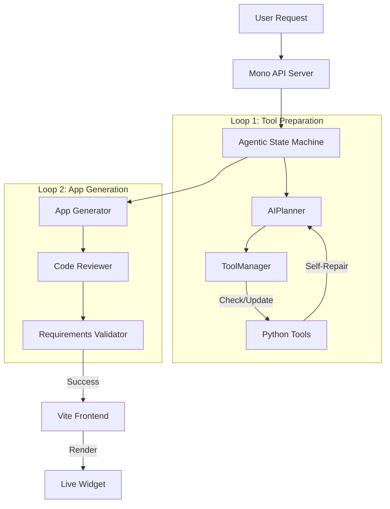

I spoke today at [AI Tinkerers Raleigh](https://raleigh.aitinkerers.org/talks/rsvp_rjOw3LBlaI4) about what happens when AI inference becomes fast enough to fundamentally change how we think about application design.


## Cerebras OS v3 - Agentic Desktop Environment

This isn't just a demo; it's a next-generation AI-powered desktop environment where applications are generated, run, and repaired in real-time by a sovereign agentic system. And it's all powered by Cerebras' ultra-fast inference.

### Overview

<p><iframe style="width:100%;" height="515" src="https://www.youtube.com/embed/eFMeGK16u8U" frameborder="0" allowfullscreen></iframe></p>
This project represents a massive shift from static applications to a **dynamic, agentic OS**. Instead of pre-compiled binaries, the "OS" is a living conversation with a high-speed LLM that can:
1.  **Generate Apps**: Create full HTML/JS/WebGL applications on the fly.
2.  **Execute Tools**: Bridge the gap between the web frontend and the host system using Python tools.
3.  **Self-Repair**: Detect errors in both app code and system tools, and autonomously rewrite them to fix the issue.

### Architecture

The system is built on a modern Node.js stack with a unique **Agentic State Machine** core.



#### Key Components

1.  **Server (`cerebrasv3/server`)**: A robust Express/TypeScript backend that hosts the State Machine.
    *   **Intent Classification**: Determines if you want a new app, a tool execution, or a "virtual response" (raw content).
    *   **Tool Manager**: Manages a library of Python scripts that grant system access (Filesystem, Hardware, Audio).
    *   **Self-Healing**: If a tool fails (e.g., syntax error, missing dependency), the system captures the error, feeds it back to the LLM, and **rewrites the Python code** automatically.

2.  **Frontend (`cerebrasv3/client`)**: A Vite/React-based desktop interface.
    *   **Window Manager**: Draggable, resizable windows for generated apps.
    *   **Live Injection**: Receives HTML/JS payloads from the server and injects them into sandboxed containers.

3.  **Cerebras Engine**: The brain of the operation.
    *   Utilizes `llama3.1-70b` or `qwen` models via Cerebras API for sub-second inference.

### Features

#### Dynamic Tool System
The system doesn't just call APIs—it **writes** them. If you ask for "a tool to check my CPU temp", and it doesn't exist:
1.  The Planner designs the tool.
2.  The State Machine generates the Python script (`server/tools/cpu_temp.py`).
3.  The Tool Manager registers it.
4.  The App uses it immediately.

#### Agentic State Machine
A sophisticated 2-loop architecture ensures reliability:
*   **Tool Prep Loop**: Ensures all necessary system access tools exist and are functional *before* writing any UI code.
*   **App Gen Loop**: Generates the UI, reviews the code for security/syntax issues, and verifies it meets the user's prompt.

#### Virtual API Responses
For requests that don't need a UI (e.g., "Generate a CSV report of my files"), the system bypasses the App Generator and streams the raw content directly to the client, acting as a virtual file server.

### Getting Started

If you want to try it out, the stack is surprisingly simple:

#### Prerequisites
*   Node.js v18+
*   Python 3.9+ (for tool execution)
*   Cerebras API Key

#### Installation

1.  Navigate to the project directory:
    ```bash
    cd cerebrasv3
    ```

2.  Install dependencies:
    ```bash
    npm install
    ```

3.  Set up environment:
    ```bash
    export CEREBRAS_API_KEY=your_key_here
    export DESKTOP_AI_PROVIDER=cerebras
    ```

#### Running

To launch both the backend server and the frontend client:

```bash
npm run dev
```

*   **Frontend**: http://localhost:5173
*   **Backend**: http://localhost:4000

---

This is just the beginning. As inference speeds continue to improve, we'll see entirely new categories of software that simply couldn't exist before.
